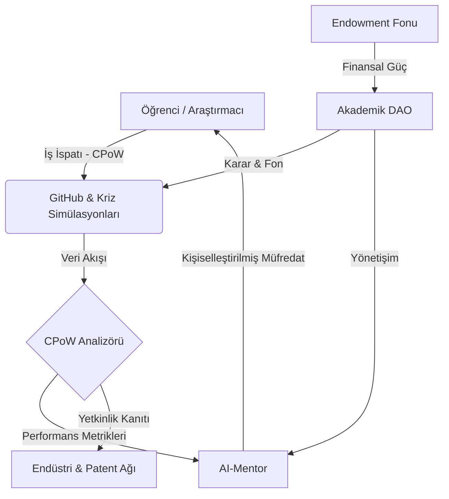

# 🏛️ Project Muassir-University: The Higher Education OS

**"Türk Yükseköğretim Sistemini Dünyanın Zirvesine Taşıyacak Radikal Reform ve Yapay Zeka Entegrasyonu Araştırma Reposu"**

> **"Bilim ve teknolojide bir numara olmak bir tercih değil, varoluş mücadelesidir."**

---

## 🎯 Vizyon: 10 Yılda İlk 200 (The Vision)

Türkiye Cumhuriyeti'nin 2. yüzyılında, 50 Türk üniversitesini dünya sıralamasında (QS/THE) ilk 200 bandına sokmak bir hayal değil, bir **sistem tasarımı** meselesidir. Mevcut yükseköğretim mimarisi (YÖK 1.0), 19. yüzyılın sanayi toplumu ihtiyaçlarına göre (standardizasyon, ezber, itaat) kurgulanmıştır. 

**Muassır-University (The Higher Education OS)**, bu hantal işletim sistemini silip yerine **AI-Native**, **Bölümsüz** ve **Radikal Özerk** bir çekirdek (kernel) yerleştirir.

---

## 🏗️ Sistem Mimarisi (System Architecture)

Muassır-University, statik bir yapı değil, sürekli kendini optimize eden bir ekosistemdir:

---

## 📜 Muassır Manifesto: Derinlikli Bakış (The Deep Dive)

### 🛡️ 1. Teknolojik Egemenlik (Technological Sovereignty)
Eğitim sistemi, bir milletin en stratejik savunma hattıdır. AI çağında, "bilgiyi tüketen" bir toplum olmak, dijital sömürgeleşmeyi kabul etmektir. Muassır modeli, öğrenciyi AI'ın efendisi (Prompt Engineer değil, Sistem Mimarı) kılarak ulusal teknolojik egemenliği garanti altına alır.

### 🧠 2. Kognitif Protez Çağı (Age of Cognitive Prosthesis)
Yapay Zeka, artık bir "yardımcı araç" değildir. O, insan bilişinin (cognition) bir uzantısı, sentetik bir protezdir. Muassır müfredatında, AI ile simbiyotik bağ kurmak bir "soft skill" değil, mezuniyetin ön koşuludur.

---

## 🚀 Beş Temel Sütun (The Strategic Pillars)

Her sütun, akademik bir White Paper ciddiyetinde detaylandırılmıştır:

### ⚙️ [1. Sürekli İş İspatı (CPoW) Protokolü](assessment-models/cpow-protocol.md)
*   **Vize/Finalin Ölümü:** Hafıza ölçen sınavlar yerine, GitHub commit'leri ve terminal başında çözülen gerçek zamanlı krizleri esas alır.
*   **Teknik Altyapı:** [CPoW Analizörü Teknik Şartnamesi](proposals/cpow-analyzer-mock.md)

### 🧠 [2. AI-Native Müfredat ve Sentetik Eğitim](ai-integration/ai-native-curriculum.md)
*   **AI-Mentor:** Her öğrenciye özel 24/7 rehberlik eden, bilişsel boşlukları anlık tespit eden ajanlar.
*   **Uzmanlık Modülleri:** [AI-Robotik Skill Tree Örneği](ai-integration/skill-tree-ai-robotics.md)

### 📜 [3. Akademik DAO ve YÖK 2.0](legislative-framework/yok-reform-proposal.md)
*   **Otonom Yönetim:** Kararların dekanlar değil, liyakat ağırlıklı algoritmalar ve topluluk oylarıyla alınması.
*   **Yönetişim Tüzüğü:** [Akademik DAO Tüzüğü](legislative-framework/academic-dao-charter.md)

### 🌐 [4. Küresel Kıyaslama (Global Benchmarking)](global-benchmarking/comparative-analysis.md)
*   **Stratejik Analiz:** MIT, Stanford ve Minerva modellerinin "Legacy Debt" (miras borcu) handikapları ve Muassır'ın avantajları.

### 💰 [5. Ekonomik Model ve VC-University](economic-model/endowment-patent-strategy.md)
*   **Endowment:** Devlet bütçesinden bağımsız, patent gelirleri ve bağışlarla beslenen devasa yatırım fonu.
*   **Patent-First:** Akademik yükselme kriterlerinde "Makale Sayısı" yerine "Uygulanan Patent" zorunluluğu.

---

## 📊 Karşılaştırmalı Sistem Analizi (Deep Matrix)

| Özellik | Geleneksel Sistem (Legacy) | Muassır Model (The New OS) | Stratejik Etki |
| :--- | :--- | :--- | :--- |
| **Ölçme Birimi** | Kredi (Zaman Bazlı) | Etki Faktörü (Üretim Bazlı) | Yüksek Üretkenlik |
| **Değerlendirme** | Statik (Vize/Final) | Dinamik (CPoW / 24/7) | Sıfır Hata Payı |
| **Yapı** | Bölüm Odaklı (Silo) | Yetkinlik Odaklı (Skill-Tree) | Esnek İş Gücü |
| **Finansman** | Merkezi Bütçe | Otonom Endowment & Patent | Tam Bağımsızlık |
| **Hoca Rolü** | Lektör (Bilgi Aktaran) | Küratör & Stratejik Rehber | Yüksek Entelektüel Katma Değer |

---

## 🛠️ Teknik Ekosistem (The Living Prototype)

Projenin vizyonunu somutlaştıran interaktif bileşenler:
- **[Etkileşimli Portal (index.html)](index.html):** Projenin görsel ve fonksiyonel vitrini.
- **[Öğrenci Dashboard Simülasyonu](index.html#dashboard):** CPoW ve AI-Mentor takibi arayüzü.

---

## ⛓️ Yol Haritası (Strategic Roadmap)

- [x] **V1.0 (The Manifesto):** Temel kuramsal çerçeve.
- [x] **V2.0 (The Prototype):** Teknik mimari ve görsel portal.
- [/] **V3.0 (The Implementation):** Akademik DAO yönetişimi ve Yetenek Ağaçlarının detaylandırılması.
- [ ] **V4.0 (Cognitive Leap):** BCI (Beyin-Bilgisayar Arayüzü) entegreli eğitim protokolleri.

---

## 🤝 Katılım ve Akademik Direniş (Contribute)

Bu proje, statükoyu koruyan akademik kurumlara bir **meydan okumadır.** Siz de bu "Akademik İsyana" katılın:

1.  **Analiz:** Mevcut sistemdeki bir "yapısal hatayı" (structural bug) belgeleyin.
2.  **Geliştir:** [Pull Request] ile yeni bir Skill-Tree veya Mevzuat Önerisi gönderin.
3.  **Uygula:** Kendi araştırma topluluğunda Muassır Protokollerini test et.

---

*Muassir-University © 2026. Distributed under MIT License. Proje, Türkiye'nin entelektüel egemenliğini AI çağında garanti altına almayı hedefler.*

---
> **"Gelecek, onu inşa edenlerindir."**

