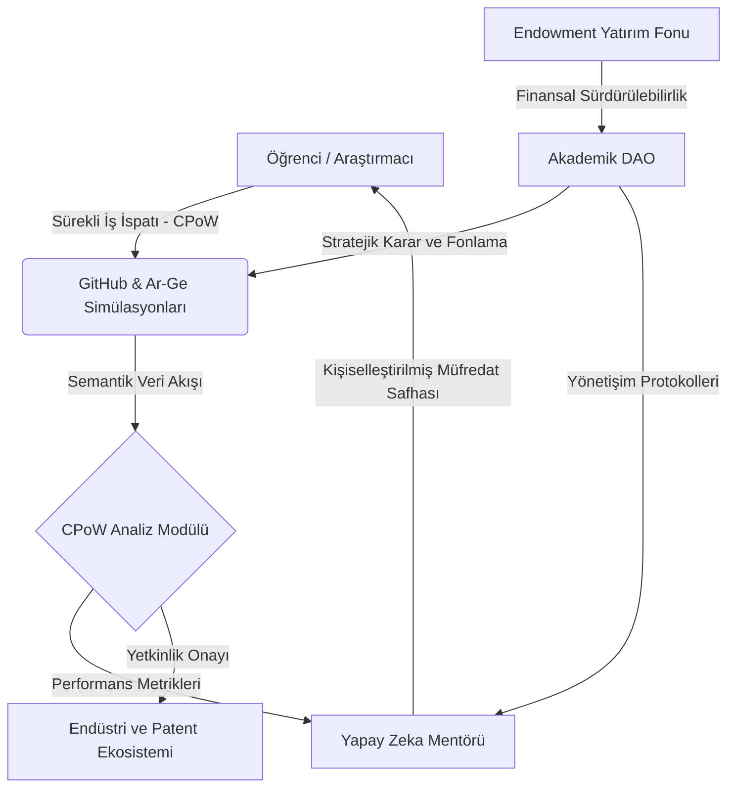

# 🏛️ Project Muassir-University: Yükseköğretim İşletim Sistemi (The Higher Education OS)

**"Türk Yükseköğretim Sisteminin Küresel Rekabet Gücünü Artırmaya Yönelik Radikal Reform ve Yapay Zeka Entegrasyon Stratejisi"**

> **"Bilim ve teknolojide öncü olmak, ulusal egemenliğin ve ekonomik bağımsızlığın temel taşıdır."**

---

## 🎯 Vizyon ve Stratejik Hedefler

### 1. Sistemsel Dönüşüm Mimari
Project Muassir-University, Türk yükseköğretim kurumlarını on yıl içerisinde dünya sıralamalarında (QS, THE) ilk 200 bandına taşıyacak yapısal bir **ekosistem tasarımıdır.** Mevcut hiyerarşik ve statik eğitim modelleri (YÖK 1.0), yerini dinamik, veriye dayalı ve liyakat esaslı bir **"Akademik İşletim Sistemine"** bırakmaktadır.

### 2. Yapay Zeka Yerleşik (AI-Native) Yaklaşım
Bu proje, yapay zekayı bir yardımcı araç olarak değil, eğitim sisteminin **temel çekirdeği (kernel)** olarak konumlandırır. Bilgi aktarımı süreçlerinin otonomlaştırılması, akademik personelin yüksek katma değerli araştırma ve mentorluk faaliyetlerine odaklanmasını sağlar.

---

## 🏗️ Sistem Mimarisi ve Veri Akışı

Muassır-University, sürekli kendini optimize eden bir öğrenme ve üretim ekosistemidir. Aşağıdaki mimari, akademik üretimin finansal ve idari otonomiyle olan entegrasyonunu temsil eder:

---

## 📜 Operasyonel İlkeler: Derinlemesine Teknik Bakış

### 🛡️ Teknolojik Egemenlik (Technological Sovereignty)
Eğitim sistemleri, milletlerin stratejik savunma ve kalkınma önceliklerinin başında gelir. Muassır modeli, bireyleri teknolojiyi tüketen pasif kullanıcılar olmaktan çıkarıp, karmaşık sistemleri tasarlayan ve yöneten **Sistem Mimarları** olarak yetiştirmeyi hedefler. Bu, ulusal teknolojik bağımsızlığın temelidir.

### 🧠 Kognitif Simbiyoz ve Protez Çağı
Yapay Zeka, insan bilişsel kapasitesinin bir uzantısı olarak kabul edilir. Eğitim süreci, bilginin ezberlenmesinden ziyade, yapay zeka ile simbiyotik bir bağ kurarak yeni bilgi ve çözümler üretme yetkinliğini esas alır. Mezuniyet kriteri, bireyin yapay zeka sistemleriyle kurguladığı entelektüel katma değerdir.

---

## 🚀 Temel Stratejik Sütunlar

### ⚙️ [1. Sürekli İş İspatı (CPoW) Protokolü](assessment-models/cpow-protocol.md)
*   **Dinamik Değerlendirme:** Geleneksel sınav sistemleri yerine, GitHub etkileşimleri ve gerçek zamanlı problem çözme metriklerini esas alan nesnel bir ölçümleme protokolüdür.
*   **Teknik Rapor:** [CPoW Analizör Modülü Teknik Şartnamesi](proposals/cpow_analyzer-mock.md)

### 🧠 [2. AI-Native Müfredat Tasarımı](ai-integration/ai-native-curriculum.md)
*   **Otonom Rehberlik:** Her bireye özel öğrenme patikaları sunan, bilişsel eksiklikleri anlık saptayan RAG tabanlı uzman sistemler.
*   **İleri Seviye Protokoller:** [Nöral Etkileşim Protokolü (V4.0)](ai-integration/neural-protocol-v4.md)

### 📜 [3. Akademik DAO ve Kurumsal Yönetişim](legislative-framework/yok-reform-proposal.md)
*   **Karesel Yönetişim:** Karar alma süreçlerinin, paydaşların somut üretim çıktılarına (CPoW) göre ağırlıklandırıldığı şeffaf ve merkeziyetsiz yönetim modeli.
*   **Tüzük:** [Akademik DAO Yönetişim Tüzüğü](legislative-framework/academic-dao-charter.md)

### 💰 [4. Ekonomik Model ve Finansal Otonomi](economic-model/endowment-patent-strategy.md)
*   **Endowment ve IP Stratejisi:** Üniversiteyi kamu bütçesinden bağımsız kılan, patent gelirleri ve startup iştirakleriyle beslenen sürdürülebilir bir finansal mimari.

---

## 📈 Stratejik Analiz ve Yol Haritası

Mevcut sistemin yapısal darboğazlarını ve on yıllık gelişim stratejisini içeren kapsamlı analiz belgesine aşağıdan ulaşabilirsiniz:

➡️ **[Stratejik Analiz: Türk Eğitiminde Yapısal Dönüşüm ve 10 Yıllık Yol Haritası](proposals/strategic-foundation.md)**

---

## 🛠️ Teknik Envanter ve Prototip Araçlar

Projenin teknik geçerliliğini destekleyen interaktif bileşenler:
- **[Etkileşimli Kurumsal Portal (index.html)](index.html):** Vizyonun dijital yansıması.
- **[Akademik Dashboard Simülasyonu](index.html#dashboard):** CPoW ve Mentor etkileşim arayüzü.
- **[CPoW Analizör Yazılımı (Python)](scripts/cpow_analyzer.py):** Veri analitik simülasyon aracı.

---

## 🤝 Katılım ve Kurumsal İşbirliği (Contribute)

Project Muassir-University, akademik ve teknolojik dünyadaki tüm paydaşların katkısına açık bir araştırma inisiyatifidir:

1.  **Analitik Katkı:** Mevcut yapısal sorunlara yönelik veri temelli raporlar sunun.
2.  **Modüler Geliştirme:** Skill-Tree veya mevzuat önerileri ile ekosistemi genişletin.
3.  **Uygulama:** Kendi bünyenizde Muassır protokollerini (CPoW) test ederek geri bildirim sağlayın.

---
*Muassir-University © 2026. MIT Lisansı kapsamında korunmaktadır. Bu çalışma, Türkiye'nin yapay zeka çağındaki entelektüel egemenliğini güvence altına almayı hedefler.*

---
> **"Gelecek, onu bugünden tasarlayanlarındır."**
