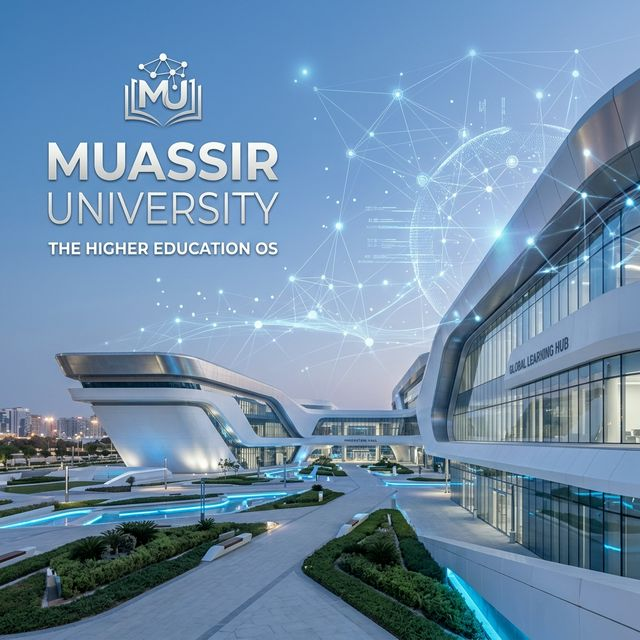
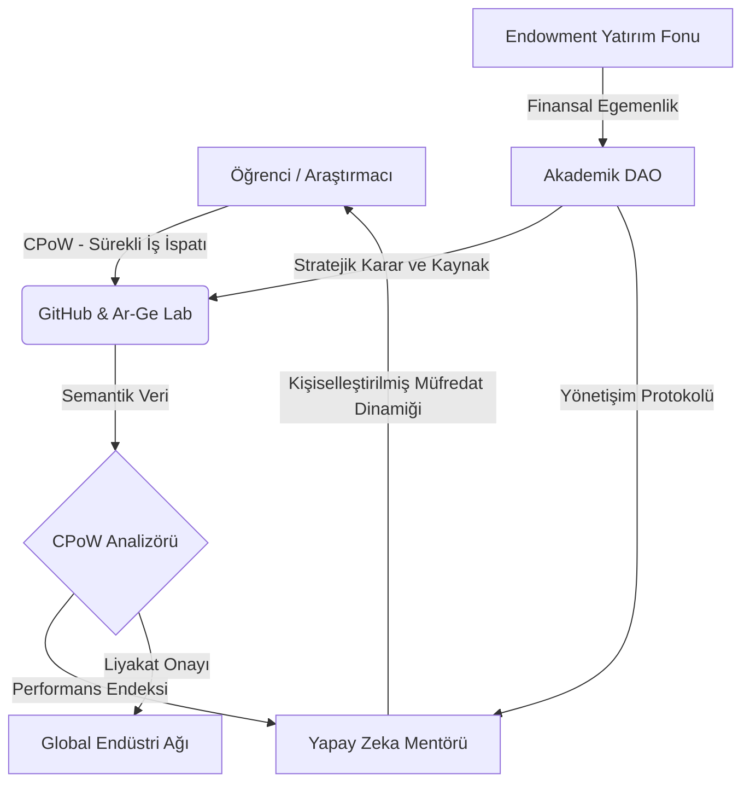

# 🏛️ Project Muassir-University: Yükseköğretim İşletim Sistemi (The Higher Education OS)

**"Yapay Zeka Çağında Türk Akademik Ekosisteminin Küresel Liderliğini Hedefleyen Radikal Dönüşüm Manifestosu"**

> **"Bilgiye hükmetmek bir tercih değil, egemenlik mücadelesidir. Muassır-University, bu mücadelenin teknik ve stratejik işletim sistemidir."**

---

## 🎯 Stratejik Vizyon: Küresel Sıçrama (The Leapfrog Strategy)

### 1. Kurumsal Kernel Değişimi
Türkiye Cumhuriyeti'nin ikinci yüzyılında, 50 Türk üniversitesinin dünya sıralamalarında (QS, THE) ilk 200 bandına taşınması, mevcut hiyerarşik yapıların (YÖK 1.0) rehabilitasyonu ile mümkün değildir. Project Muassir-University, bu yapıların üzerine inşa edilmek yerine, üniversitenin temel "Kernel"ini (çekirdeğini) bütünüyle değiştiren **AI-Native** ve **Radikal Özerk** bir model sunar.

### 2. Bilgi Sentezi ve Üretim Faktörü
Geleneksel eğitim, bilgiyi depolamayı (hafıza) hedeflerken; Muassır modeli, bilginin yapay zeka ile simbiyotik bir bağ kurularak işlenmesini ve somut bir değer (Ar-Ge, Patent, Startup) üretilmesini esas alır. Biz, diplomalı işsizler değil, **Küresel Teknoloji Mimarları** yetiştiriyoruz.

> [!IMPORTANT]
> **Stratejik Temeller:** Neden Türkiye'den dünyanın en iyi üniversitesi çıkmıyor ve AI çağında 10 yılda nasıl zirveye çıkarız? 
> ➡️ **[Stratejik Analiz ve 10 Yıllık Yol Haritası](proposals/strategic-foundation.md)**

---

## 🏗️ Sistem Mimarisi: Otonom Akademik Ekosistem

Muassır-University, statik bir bina değil, sürekli kendini optimize eden dijital bir organizmadır.

---

## 🚀 Beş Stratejik Temel (The Pillars)

### ⚙️ [1. Sürekli İş İspatı (CPoW) Protokolü](assessment-models/cpow-protocol.md)
*   **Değerlendirme Devrimi:** Statik sınavların yerini alan, GitHub etkileşimleri ve açık kaynak üretim metriklerini baz alan nesnel bir ölçümleme sistemi.
*   **Prototip:** [CPoW Analizör Modülü (Python)](scripts/cpow_analyzer.py)

### 🧠 [2. AI-Native Müfredat ve Nöral Entegrasyon](ai-integration/ai-native-curriculum.md)
*   **Otonom Mentorluk:** Her öğrenciye özel, bilişsel boşlukları anlık tespit eden ve **IEEE ISCT 2025** standartlarında (KG-RAG) rehberlik eden sistemler.
*   **İleri Seviye:** [BCI Nöral Protokolü (V4.0)](ai-integration/neural-protocol-v4.md)

### 📜 [3. Akademik DAO ve Liyakat Esaslı Yönetişim](legislative-framework/yok-reform-proposal.md)
*   **Merkeziyetsiz Yönetim:** Kararların, paydaşların somut akademik üretim çıktılarına (CPoW) göre ağırlıklandırıldığı akıllı kontratlar üzerinden alınması.
*   **Tüzük:** [Akademik DAO Yönetişim Tüzüğü](legislative-framework/academic-dao-charter.md)

### 🌐 [4. Küresel Akreditasyon ve Peer-Review 2.0](global-benchmarking/comparative-analysis.md)
*   **Decentralized Accreditation:** Diplomanın yerini alan, blockchain üzerinde doğrulanmış ve global endüstri tarafından anlık tanınan "Yetkinlik Madalyonları".

### 💰 [5. Ekonomik Model: VC-University](economic-model/endowment-patent-strategy.md)
*   **Endowment ve IP:** Üniversiteyi kamu bütçesinden bağımsız kılan, patent ve startup iştirakleriyle beslenen sürdürülebilir finansal mimari.

---

## 📂 Disiplinlerarası Fakülte Taslakları (Departmental Blueprints)

Muassır modelinde bölümler statik değil, dinamik "Yetenek Ağaçları" (Skill-Trees) şeklindedir:

### 🔬 [Siber-Biyoloji ve Sentetik Yaşam](proposals/skill-tree-bio.md)
AI asistanlarıyla protein tasarımı, sentetik DNA dizileme ve biyo-etik hizalama yetkinlikleri.
### ⚛️ [Kuantum Sistem Mimarisi](proposals/skill-tree-quantum.md)
Kuantum algoritmaları, kriptografik savunma ve kuantum hatası düzeltme protokolleri.
### ⚖️ [Algoritmik Etik ve Bilişsel Haklar](legislative-framework/cognitive-rights.md)
AI-insan simbiyozunda veri mülkiyeti, düşünce özgürlüğü ve bilişsel güvenlik yasaları.

---

## 🎭 Operasyonel Hikaye: Muassır'da Bir Gün (Day in the Life)

> *"Saat 09:00. BCI arayüzüm AI-Mentor ile senkronize oldu. Mentor, dün gece yazdığım 'Neural Kinematics' kodunda bir regresyon saptamış. Kahvem gelmeden GitHub PR'ımı optimize etmem için bir 'Deep Sync' oturumu öneriyor. Saat 11:00'de Akademik DAO'da yeni 'Qu-Bit Stability' skill-tree önerisi oylanacak. CPoW skorum yettiği için oylamada ağırlığım %1.2. Bugün diploma değil, patent peşindeyim. Mentor'un önerdiği arXiv makalesini nöral kanaldan okurken, verimliliğimin %14 arttığını görüyorum."*

---

## 🛠️ Teknik Envanter ve Prototip Araçlar

Projenin teknik geçerliliğini destekleyen interaktif bileşenler:
- **[Etkileşimli Kurumsal Portal (index.html)](index.html):** Vizyonun dijital vitrini.
- **[Akademik Dashboard Simülasyonu](index.html#dashboard):** CPoW ve Mentor etkileşim arayüzü.
- **[Research Bibliography](proposals/research-bibliography.md):** 2024-2025 akademik kanıt temeli.

---

## 🤝 Katılım ve Kurumsal İşbirliği (Contribute)

Project Muassir-University, statükoyu dönüştürmek isteyen tüm araştırmacılara açık bir araştırma platformudur:

1.  **Analiz:** Mevcut sisteme dair yapısal hata raporları sunun.
2.  **Geliştir:** [Pull Request] ile yeni Skill-Tree veya Mevzuat Önerisi gönderin.
3.  **Uygula:** Kendi araştırma topluluğunuzda CPoW protokollerini test edin.

---
*Muassir-University © 2026. Proje, Türkiye'nin entelektüel egemenliğini AI çağında garanti altına almayı hedefler.*

---
> **"Gelecek, onu bugünden tasarlayanlarındır."**
