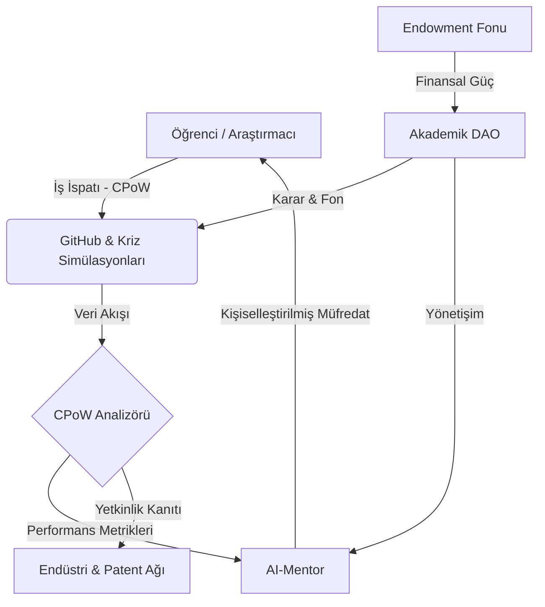

# 🏛️ Project Muassir-University: The Higher Education OS

**"Türk Yükseköğretim Sistemini Dünyanın Zirvesine Taşıyacak Radikal Reform ve Yapay Zeka Entegrasyonu Araştırma Reposu"**

> **"Bilim ve teknolojide bir numara olmak bir tercih değil, varoluş mücadelesidir."**

---

## 🎯 Vizyon: 10 Yılda İlk 200 (The Vision)

### 1. Sistem Tasarımı Olarak Eğitim
Türkiye Cumhuriyeti'nin 2. yüzyılında, 50 Türk üniversitesini dünya sıralamasında (QS/THE) ilk 200 bandına sokmak bir hayal değil, bir **sistem tasarımı** ve **mimari dönüşüm** meselesidir. Mevcut yükseköğretim mimarisi (YÖK 1.0), 19. yüzyılın sanayi toplumu ihtiyaçlarına göre (standardizasyon, ezber, itaat) kurgulanmış hantal bir yapıdır. Bu yapı, bilgiyi depolayan (hafıza odaklı) bireyler yetiştirmeyi hedeflerken, AI çağının "bilgi işleyen ve sentezleyen" ihtiyaçlarına yanıt verememektedir.

### 2. Radical Kernel Replacement
**Muassır-University (The Higher Education OS)**, bu hantal işletim sistemini silip yerine **AI-Native**, **Bölümsüz** ve **Radikal Özerk** bir çekirdek (kernel) yerleştirir.

> [!IMPORTANT]
> **Stratejik Temeller:** Neden Türkiye'den dünyanın en iyi üniversitesi çıkmıyor ve AI çağında 10 yılda nasıl zirveye çıkarız? 
> ➡️ **[Stratejik Analiz ve 10 Yıllık Yol Haritası](proposals/strategic-foundation.md)**
 Bu dönüşüm, sadece müfredat güncellemesi değil; üniversitenin varoluş amacının, finansal modelinin ve yönetim şemasının kökten değiştirilmesidir. Biz, üniversiteyi bir "okul" olarak değil, bir "entelektüel işletim sistemi" olarak görüyoruz.

---

## 🏗️ Sistem Mimarisi (System Architecture)

Muassır-University, statik bir yapı değil, sürekli kendini optimize eden bir ekosistemdir. Aşağıdaki diyagram, öğrencinin üretim sürecinden başlayarak finansal ve idari otonomiye uzanan veri ve değer akışını temsil eder:

---

## 📜 Muassır Manifesto: Derinlikli Bakış (The Deep Dive)

### 🛡️ 1. Teknolojik Egemenlik (Technological Sovereignty)
Eğitim sistemi, bir milletin en stratejik savunma hattıdır. AI çağında, "bilgiyi tüketen" bir toplum olmak, dijital sömürgeleşmeyi kabul etmektir. Muassır modeli, öğrenciyi AI'ın efendisi (Prompt Engineer değil, Sistem Mimarı) kılarak ulusal teknolojik egemenliği garanti altına alır. Bu egemenlik, sadece yazılım kullanmak değil, AI modellerini yerel ihtiyaçlara ve kültürel kodlara göre yeniden eğitme ve yönetme yetkinliğidir.

### 🧠 2. Kognitif Protez Çağı (Age of Cognitive Prosthesis)
Yapay Zeka (AI), artık bir yardımcı araç (tool) değil, insan zekasının biyolojik sınırlarını aşmasını sağlayan sentetik bir protezdir. Muassır modelinde AI, öğrenciyle simbiyotik bir bağ kurar. Bu bağ, bilginin ezberlenmesini değil, AI tarafından sağlanan veri setlerinin insan yaratıcılığı (human creativity) ile sentezlenmesini esas alır. Mezunlarımız, "AI ile beraber neyi, ne kadar hızlı inşa edebildikleriyle" ölçülürler.

---

## 🚀 Beş Temel Sütun (The Strategic Pillars)

### ⚙️ [1. Sürekli İş İspatı (CPoW) Protokolü](assessment-models/cpow-protocol.md)
*   **Vize/Finalin Ölümü:** Hafıza ölçen sınavlar yerine, öğrencinin 24/7 üretim yaptığı GitHub commit'leri, teknik blog yazıları ve canlı sistem krizlerini esas alır. CPoW, statik diplomaların aksine, öğrencinin anlık yetkinliğini temsil eden canlı bir "Proof of Impact" portfolyosudur.
*   **Semantic Analysis:** Geliştirdiğimiz [CPoW Analizörü](proposals/cpow-analyzer-mock.md), sadece kod satırlarını değil, yapılan işin "etki değerini" (impact score) ölçen semantik bir analiz yapar.

### 🧠 [2. AI-Native Müfredat ve Sentetik Eğitim](ai-integration/ai-native-curriculum.md)
*   **AI-Mentor:** Her öğrenciye özel, akademik boşlukları anlık saptayan ve kişiye özel öğrenme yolu (Pathfinder) çizen sentetik rehberler. Bu mentorlar, öğrencinin uyku düzeninden kodlama hızına kadar her şeyi analiz ederek "Optimal Öğrenme Durumu"nu (Flow state) korumayı hedefler.
*   **Uzmanlık:** [AI-Robotik Skill Tree Örneği](ai-integration/skill-tree-ai-robotics.md) üzerinden görülebileceği gibi, öğrenme süreci doğrusal değil, ağaç yapısında genişleyen bir keşiftir.

### 📜 [3. Akademik DAO ve YÖK 2.0](legislative-framework/yok-reform-proposal.md)
*   **Otonom Yönetim:** Kararların dekanlar veya rektörler tarafından değil, paydaşların CPoW skorlarına göre ağırlıklandırıldığı akıllı kontratlar (DAO) üzerinden alınması. Bu, akademik meritokrasinin (liyakat sisteminin) blockchain tabanlı otomasyonudur.
*   **Yönetişim:** [Akademik DAO Tüzüğü](legislative-framework/academic-dao-charter.md) üniversitenin anayasasıdır ve topluluk oylarıyla (Governance Polls) güncellenir.

### 🌐 [4. Küresel Kıyaslama (Global Benchmarking)](global-benchmarking/comparative-analysis.md)
*   **Sıçrama Advantage:** MIT, Stanford ve Minerva modellerinin "Legacy Debt" (geleneksel miras borcu) nedeniyle yapamadığı radikal dönüşümü, Muassır modelinin "Clean Slate" (temiz sayfa) avantajıyla gerçekleştirmesi. Biz, 100 yıllık hantal yapılarla rekabet etmek yerine, onlardan 100 yıl sonrasına sıçramayı hedefliyoruz.

### 💰 [5. Ekonomik Model ve VC-University](economic-model/endowment-patent-strategy.md)
*   **Endowment & IP:** Üniversite bizzat bir Risk Sermayesi (Venture Capital) gibi çalışır. Mezunların kurduğu startup'lar ve geliştirilen patentler, üniversitenin "Endowment" fonunu besler. Bu model, üniversiteyi devlet bütçesinden %100 bağımsız kılar ve sınırsız araştırma fonu üretir.

---

## 🎭 Operasyonel Hikaye: Muassır'da Bir Gün (Day in the Life)

> *"Saat 09:00. BCI arayüzüm AI-Mentor ile senkronize oldu. Mentor, dün gece yazdığım 'Neural Kinematics' kodunda bir regresyon saptamış. Kahvem gelmeden GitHub PR'ımı optimize etmem için bir 'Deep Sync' oturumu öneriyor. Saat 11:00'de Akademik DAO'da yeni 'Bio-Computing' skill-tree önerisi oylanacak. CPoW skorum yettiği için oylamada ağırlığım %1.2. Bugün diploma değil, patent peşindeyim. Mentor'un önerdiği arXiv makalesini nöral kanaldan okurken, verimliliğimin %14 arttığını görüyorum."*

---

## 📚 Muassır Sözlüğü (Glossary)

- **CPoW (Continuous Proof of Work):** Standart sınavların yerini alan, sürekli üretim ve etki bazlı değerlendirme protokolü.
- **AI-Mentor:** Öğrencinin dijital ikizi ve akademik rehberi. RAG (Retrieval-Augmented Generation) tabanlı bir uzman sistemdir.
- **Endowment:** Üniversitenin finansal otonomisini sağlayan, patent ve bağış odaklı otonom yatırım fonu.
- **Skill-Tree:** Doğrusal olmayan, yetkinlik odaklı dinamik eğitim haritası.
- **BCI (Brain-Computer Interface):** Bilginin doğrudan beyin korteksiyle senkronize edilmesini sağlayan V4.0 teknolojisi.

---

## 📉 Kurumsal Geçiş Rehberi (Adoption Guide)

Geleneksel bir üniversitenin "Muassır-ify" olması için 4 aşamalı strateji:
1. **Pilot Deployment:** Belirli bölümlerde vize/finalleri kaldırıp [CPoW Analizörü](scripts/cpow_analyzer.py) ile değerlendirmeye geçiş.
2. **AI-Mentor Integration:** Setiap öğrencinin teknik verisini işleyen yerel AI modellerinin devreye alınması.
3. **Financial Spin-off:** Patent ofisinin bir VC (Venture Capital) gibi yapılandırılarak otonom bütçe üretimine başlanması.
4. **Governance Migration:** Yönetimin Akademik DAO yapısına devredilerek liyakat bazlı dijital yönetişime geçilmesi.

---

## 📊 Karşılaştırmalı Sistem Analizi (Deep Matrix)

| Özellik | Geleneksel Sistem (Legacy) | Muassır Model (The New OS) | Stratejik Etki Faktörü |
| :--- | :--- | :--- | :--- |
| **Ölçme Birimi** | Kredi (Zaman Bazlı) | Etki Faktörü (Üretim Bazlı) | Yüksek Verimlilik |
| **Değerlendirme** | Statik (Vize/Final) | Dinamik (CPoW / 24/7) | Hatasız Yetkinlik Ölçümü |
| **Yapı** | Bölüm Odaklı (Silo) | Yetkinlik Odaklı (Skill-Tree) | Disiplinlerarası Üretim |
| **Finansman** | Merkezi Bütçe | Otonom Endowment & Patent | Tam Finansal Özgürlük |
| **Hoca Rolü** | Lektör (Bilgi Aktaran) | Küratör & Stratejik Rehber | Yüksek Entelektüel Mentorluk |

---

## 🛠️ Teknik Ekosistem (The Living Prototype)

Projenin vizyonunu somutlaştıran interaktif araçlar:
- **[Etkileşimli Portal (index.html)](index.html):** Modern web teknolojileriyle (Glassmorphism) hazırlanmış projenin vitrini.
- **[Öğrenci Dashboard Simülasyonu](index.html#dashboard):** CPoW skorları, Skill-Tree ilerlemesi ve **AI-Mentor Chat** arayüzü.
- **[Teknik Prototip: CPoW Analizör Scripti (Python)](scripts/cpow_analyzer.py):** Öğrenci verilerini simüle eden ve raporlayan teknik araç.

---

## 📚 Bilimsel Arka Plan ve Kaynakça (Evidence Based)

Muassır-University, sadece bir vizyon belgesi değildir; en güncel (2024-2025) akademik araştırmalar ve küresel pilot projeler üzerine kurgulanmıştır.

➡️ **[Araştırma Kaynakçası ve Küresel Kanıt Temeli](proposals/research-bibliography.md)**

---

## ⛓️ Yol Haritası (Strategic Roadmap)

- [x] **V1.0 (The Manifesto):** Temel kuramsal çerçeve ve 5 stratejik sütunun inşası.
- [x] **V2.0 (The Prototype):** Teknik şartnameler, CPoW mockups ve fütüristik görsel portal.
- [x] **V3.0 (The Implementation):** Akademik DAO yönetişimi, liyakat bazlı oylama simülasyonu ve Yetenek Ağaçları.
- [/] **V4.0 (Cognitive Leap):** BCI (Beyin-Bilgisayar Arayüzü) entegreli eğitim protokolleri ve Nöral Etik Sözleşmesi.

---

## 🤝 Katılım ve Akademik Direniş (Contribute)

Bu proje, statükoyu koruyan akademik kurumlara teknik bir **meydan okumadır.** Siz de bu "Akademik İsyana" katılın:

1.  **Analiz:** Mevcut sistemdeki bir "yapısal hatayı" (CPoW dışı, ezberci yapı) saptayın ve belgeleyin.
2.  **Geliştir:** [Pull Request] ile sisteme yeni bir Skill-Tree veya Mevzuat Önerisi (Yeni YÖK maddesi) gönderin.
3.  **Uygula:** Kendi laboratuvarınızda veya araştırma topluluğunuzda Muassır Protokollerini (CPoW) test edin.

---

*Muassir-University © 2026. Distributed under MIT License. Proje, Türkiye'nin entelektüel egemenliğini AI çağında garanti altına almayı hedefler.*

---
> **"Gelecek, onu inşa edenlerindir."**
