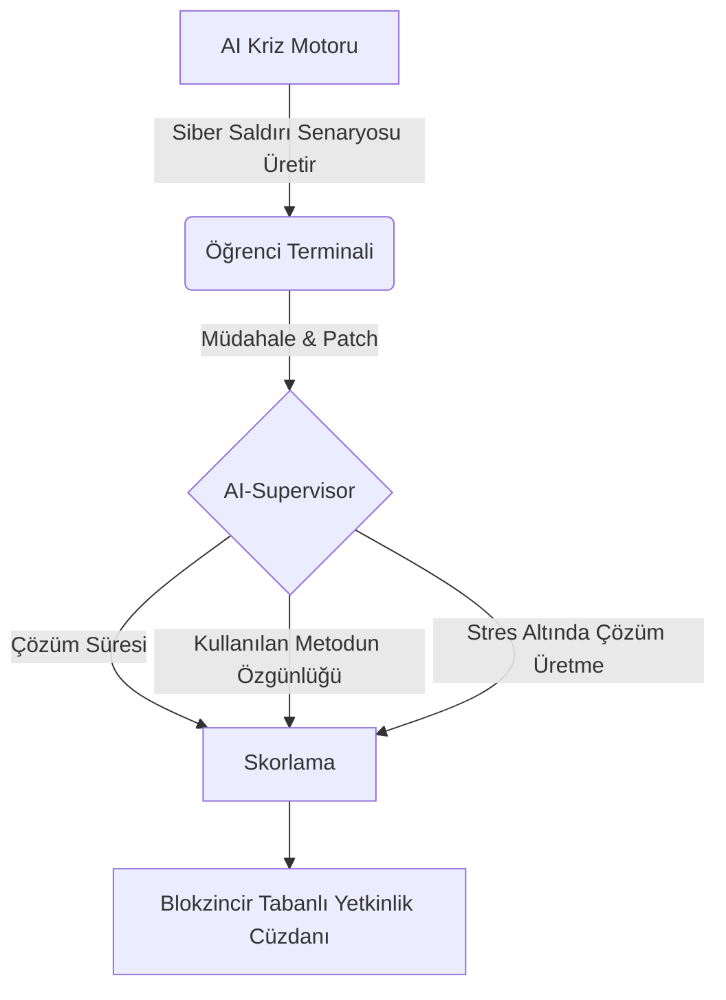

# 💠 Sürekli İş İspatı (Continuous Proof of Work - CPoW) Değerlendirme Protokolü

## 1. Geleneksel Sınavların Ölümü (The Death of Traditional Exams)
Mevcut yükseköğretim sistemindeki "Vize/Final" mimarisi, bilgiyi üretmeyi değil, **kısa süreli hafızaya alıp kusmayı (regurgitation)** ödüllendirmektedir. Bu sistem, ChatGPT ve benzeri AI sistemlerinin saniyeler içinde çözebileceği kapalı uçlu problemleri merkeze alarak insan zekasını yanlış bir metrikle ölçmektedir.

**Çözüm:** *Sürekli İş İspatı (CPoW)*. Tıpkı blockchain ağlarındaki konsensüs algoritmaları gibi, öğrencinin akademik değeri tek bir andaki (sınav anı) performansına göre değil, **zamana yayılan ve kriptografik/açık kaynak olarak doğrulanabilen üretim geçmişine** göre belirlenir.

---

## 2. CPoW Sistem Mimarisi (System Architecture)

CPoW, üç ana değerlendirme vektörüne dayanır:

### Analitik Vektör: GitHub/GitLab Metrikleri
Öğrencilerin teorik bilgiyi kod/ürün habitatına ne kadar iyi entegre ettikleri, otomatize edilmiş AI-Crawler'lar ile analiz edilir.

*   **Algoritmik Kompleksite:** Yazılan kodun (Big O notation) verimlilik skoru.
*   **Açık Kaynak Etkisi (OSS Impact):** Öğrencinin küresel projelere (Linux, React, PyTorch vb.) yaptığı doğrulanmış Pull Request'ler.
*   **Commit İstikrarı:** Bilginin kümülatif büyümesini simgeleyen kesintisiz katkı haritası (Contribution Graph).

### Sentetik Vektör: AI-Simulated Crisis Environments (AI-SCE)
Çoktan seçmeli sorular yerine öğrenciler, gerçek zamanlı kriz senaryolarına sokulur.

**Senaryo Örnekleri:**
1.  **Supply Chain Disruption:** Küresel bir çip krizinde, fabrikanın üretim hattını optimize edecek dinamik bir algoritma yazılması.
2.  **Zero-Day Exploit:** Bir bankacılık API'sine yapılan simüle edilmiş bir saldırının 45 dakika içinde saptanıp kapatılması.
3.  **Etik İkilem:** Otonom bir aracın yapay zeka modelinin "trolley problem" (tramvay problemi) varyasyonlarındaki ağırlık optimizasyonlarının (weight optimizations) savunulması.

### Entelektüel Vektör: Peer & AI Review (Çapraz Denetim)
Öğrencinin ürettiği dokümantasyon, mimari tasarımlar ve hipotezler; hem dünyadaki diğer açık kaynak katılımcıları tarafından hem de **Gelişmiş Dil Modelleri** tarafından "Sivrilik (Sharpness)" ve "İnovasyon" metrikleriyle puanlanır.

---

## 3. Notlandırma Algoritması (The Evaluation Equation)

Geleneksel $Not = (Vize * 0.4) + (Final * 0.6)$ denklemi tamamen terk edilmiştir.

Yeni Akademik Değer Algoritması $V(x)$:

$$ V(x) = \alpha(Git_{impact}) + \beta(AI_{crisis\_resilience}) + \gamma(Patent/Paper_{factor}) $$

*   $\alpha$: Küresel entegrasyon kapasitesi (0.4)
*   $\beta$: Dinamik problem çözme ve uyum yeteneği (0.4)
*   $\gamma$: Üretilen bilginin ticarileşme veya akademik inovasyon potansiyeli (0.2)

## 4. Sonuç ve Vizyon
CPoW protokolü, öğrenciyi pasif bir dinleyiciden (listener) çıkartıp, Day 1'dan itibaren küresel teknoloji ekosisteminin aktif bir geliştiricisi (contributor) yapar. Notlar, bir kağıtta değil, Github'da ve küresel patent veritabanlarında kalıcı, inkar edilemez bir şekilde (immutable) yaşar.

> "A grade is an opinion. A merged pull request on a global repository is a universally acknowledged proof of capability."
