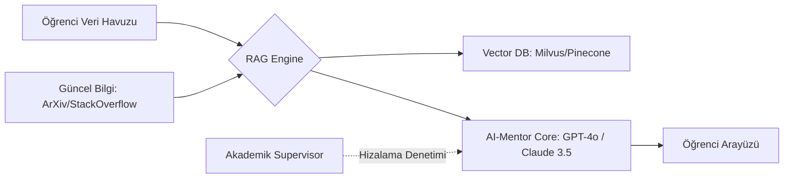

# 🤖 AI-Mentor Sistem Mimarisi: Sentetik Rehberlik Tasarımı

## 1. Kavramsal Çerçeve
AI-Mentor, öğrencinin bilişsel gelişimini 7/24 takip eden, RAG (Retrieval-Augmented Generation) ve Ajanik İş Akışları (Agentic Workflows) ile donatılmış bir "Sentetik Uzman"dır.

---

## 2. Teknik Bileşenler (Technical Stack)

### Katmanlar:
1.  **Memory Layer:** Öğrencinin geçmişteki tüm hataları, öğrenme hızı ve merak duyduğu konuların vektör tabanlı saklanması.
2.  **Contextual Logic:** "Bu öğrenci şu an bir kriz simülasyonunda, ona cevabı verme, sadece Sokratik soru sor" komutunun işletildiği katman.
3.  **Cross-Disciplinary Bridge:** Öğrenci bir "Kod" yazarken, o koddaki "Etik" veya "Ekonomik" sonuçları görmesini sağlayan çapraz referans motoru.

---

## 3. Çalışma Prensibi (Simbiyotik Döngü)
AI-Mentor, öğrenciye sadece bilgi vermez; öğrencinin **"Düşünme Modelini"** (Mental Model) optimize eder.

| Aşamalar | AI-Mentor Aksiyonu | Öğrenci Kazanımı |
| :--- | :--- | :--- |
| **Keşif** | Öğrencinin anlamadığı noktada ilgili makalelerden özet sunar. | Zamandan tasarruf. |
| **Sorgulama** | Yanlış bir mantık silsilesinde "Neden bu veri yapısını seçtin?" diye sorar. | Eleştirel düşünme. |
| **Sentez** | Öğrencinin iki farklı projesini birleştirip yeni bir startup fikri önerir. | Girişimcilik & İnovasyon. |

---

## 4. Güvenlik ve Etik (Alignment)
AI-Mentor'un "Ödev yapma makinesi" (Homework machine) haline gelmesini engellemek için **"Anti-Dependency"** algoritmaları kullanılır. Mentor, öğrencinin bilişsel kaslarını (cognitive muscles) zayıflatıyorsa, sistem kendini kısıtlar ve öğrenciyi gerçek dünyaya (veya bir insan hocaya) yönlendirir.

---

> "The goal of the AI-Mentor is not to know everything for the student, but to make the student capable of knowing everything."
